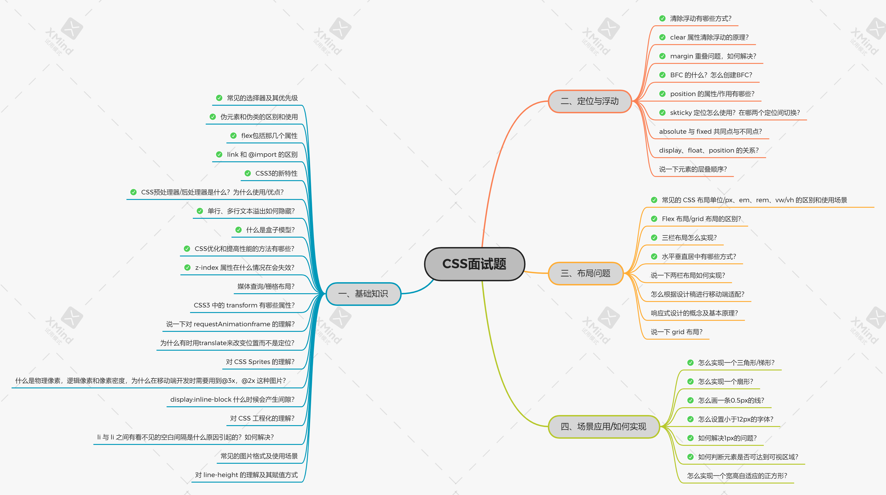

# CSS 面试题整理

> 带 ✅ 的为常见面试题（可能不准确）带 ❌ 的表示不常用 📢



## 一、基础知识

### 1.✅ 常见的选择器及其优先级？

| **选择器**     |   **格式**    | **优先级权重** |
| :------------- | :-----------: | :------------: |
| id 选择器      |      #id      |      100       |
| 类选择器       |  #classname   |       10       |
| 属性选择器     | a[ref=“eee”]  |       10       |
| 伪类选择器     | li:last-child |       10       |
| 伪类选择器     |      div      |       1        |
| 伪类选择器     |   li:after    |       1        |
| 相邻兄弟选择器 |     h1+p      |       0        |
| 子选择器       |     ul>li     |       0        |
| 后代选择器     |     li a      |       0        |
| 通配符选择器   |      \*       |       0        |

- `!important`声明的样式的优先级最高；
- **优先级顺序**为：内联样式 > 内部样式 > 外部样式 > 浏览器用户自定义样式 > 浏览器默认样式。

### 2.✅ 伪元素和伪类的区别和使用?

- **伪元素**：在内容**元素的前后插入额外的元素或样式**，但是这些元素实际上**并不在文档中生成**。`::`
- **伪类**：**将特殊的效果添加到特定选择器上**。它是已有元素上添加类别的，**不会产生新的元素**。`:`
- **总结：** **伪类是通过在元素选择器上加⼊伪类改变元素状态**，⽽**伪元素通过对元素的操作进⾏对元素的改变**。

### 3.✅flex 包括哪几个属性？

- `flex-grow,flex-shrink,flex-basics`

### 4.✅link 和 @import 的区别?

- **link 无兼容问题**，在页面载入时同时加载；
- **link**引用 CSS 时，在**页面载入时同时加载**；**@import 需要页面完全载入后加载**；
- **link 支持**使用 Javascript**控制 DOM**去改变样式；而**@import 不支持**。

### 5.✅CSS3 的新特性？

- 新增各种**CSS 选择器** （:not(.input)：所有 class 不是“input”的节点）
- **圆角** （border-radius:8px）
- **多列布局** （multi-column layout）
- **阴影和反射** （Shadoweflect）
- **文字特效** （text-shadow）
- **文字渲染** （Text-decoration）
- **线性渐变** （gradient）
- **旋转** （transform）
- 增加了**旋转,缩放,定位,倾斜,动画,多背景**

### 6.✅CSS 预处理器/后处理器是什么？为什么使用/优点？

- **预处理器**：增加复用性、mixin/变量/函数等利于开发简便、易于扩展
- **后处理器**：给浏览器添加私有前缀，解决浏览器兼容性问题
- PostCss 的 Autoprefixer 插件可以帮助我们自动增加浏览器前缀
- 结构清晰， 便于扩展；屏蔽浏览器私有语法的差异；实现多重继承；完美的兼容了`CSS`代码

### 7.✅ 单行、多行文本溢出如何隐藏？

- **单行文本溢出**

```css
overflow: hidden; // 溢出隐藏
text-overflow: ellipsis; // 溢出用省略号显示
white-space: nowrap; // 规定段落中的文本不进行换行
```

- **多行文本溢出**

```css
overflow: hidden; // 溢出隐藏
text-overflow: ellipsis; // 溢出用省略号显示
display: -webkit-box; // 作为弹性伸缩盒子模型显示。
-webkit-box-orient: vertical; // 设置伸缩盒子的子元素排列方式：从上到下垂直排列
-webkit-line-clamp: 3; // 显示的行数
```

### 8.✅ 什么是盒子模型？

- `box-sizeing: content-box`：**标准盒模型**的 width 和 height 属性的范围只包含了 content。
- `box-sizeing: border-box`：**IE 盒模型**的 width 和 height 属性的范围包含了 border、padding 和 content。

### 9.✅CSS 优化和提高性能的方法有哪些？

- **加载性能：** css 压缩；css 单一样式；减少使用@import，建议使用 link
- **选择器性能：**
  - 关键选择器：选择器的最后面的部分为关键选择器（即用来匹配目标元素的部分）。
  - 避免使用通配规则；尽量少的去对标签进行选择，而是用 class；尽量少的去使用后代选择器，降低选择器的权重值。
- **渲染性能：**
  - 慎重使用高性能属性：浮动、定位；尽量减少页面重排、重绘；去除空规则：{} ;标准化各种浏览器前缀
  - 不使用@import 前缀；选择器优化嵌套；css 雪碧图；正确使用 display 的属性；不滥用 web 字体
- **可维护性、健壮性：**
  - 将具有相同属性的样式抽离出来；样式与内容分离

### 10.✅z-index 属性在什么情况下会失效?

- 父元素 position 为 relative 时，子元素的 z-index 失效。解决：父元素 position 改为 absolute 或 static；
- 元素没有设置 position 属性为非 static 属性。解决：设置该元素的 position 属性为 relative，absolute 或是 fixed 中的一种；
- 元素在设置 z-index 的同时还设置了 float 浮动。解决：float 去除，改为 display：inline-block；

### 11.✅ 说一下对 requestAnimationframe 的理解？

- **请求动画帧**
- MDN 对该方法的描述：[**`window.requestAnimationFrame()`**](https://developer.mozilla.org/zh-CN/docs/Web/API/Window/requestAnimationFrame)

> window.requestAnimationFrame() 告诉浏览器——你希望执行一个动画，并且要求浏览器在下次重绘之前调用指定的回调函数更新动画。该方法需要传入一个回调函数作为参数，该回调函数会在浏览器下一次重绘之前执行。
>
> 用 cancelAnimationFrame()来取消执行动画

**优势**：

- CPU 节能、函数节流、减少 DOM 操作

### 12.说一下媒体查询/栅格布局?

- 使用 @media 查询，可以针对不同的媒体类型定义不同的样式

- ```html
  <!-- link元素中的CSS媒体查询 -->
  <link rel="stylesheet" media="(max-width: 800px)" href="example.css" />
  <!-- 样式表中的CSS媒体查询 -->
  <style>
    @media (max-width: 600px) {
      .facet_sidebar {
        display: none;
      }
    }
  </style>
  ```

### 13.说一下隐藏元素的方法有哪些？

- **display: none**：渲染树不会包含该渲染对象，因此**该元素不会在页面中占据位置**，也不会响应绑定的监听事件。

- **visibility: hidden**：元素在页面中**仍占据空间**，但是**不会响应绑定的监听事件**。

- **opacity: 0**：将元素的**透明度设置为 0**，以此来**实现元素的隐藏**。元素在页面中仍然占据空间，并且能够响应元素绑定的监听事件。

- **position: absolute**：通过**使用绝对定位将元素移除可视区域内**，以此来实现元素的隐藏。

- **z-index: 负值**：来**使其他元素遮盖住该元素**，以此来实现隐藏。

- **clip/clip-path** ：使用**元素裁剪的方法**来实现元素的隐藏，这种方法下，元素仍在页面中占据位置，但是不会响应绑定的监听事件。

- **transform: scale(0,0)**：将**元素缩放为 0**，来实现元素的隐藏。这种方法下，元素仍在页面中占据位置，但是不会响应绑定的监听事件。

### 14.CSS3 中的 transform 有哪些属性？

- translate 位移
- rotate 旋转
- scale 缩放
- skew 斜切

### 15.说一下 display:none 与 visibility:hidden 的区别？

（1）**在渲染树中**

- `display:none`会让元素完全**从渲染树中消失**，渲染时不会占据任何空间；
- `visibility:hidden`**不会**让元素从**渲染树中消失**，渲染的元素还会占据相应的空间，**只是内容不可见**。

（2）**是否是继承属性**

- `display:none`是**非继承属性**，子孙节点会随着父节点从渲染树消失，通过修改子孙节点的属性也无法显示；
- `visibility:hidden`是**继承属性**，子孙节点消失是由于继承了`hidden`，通过设置`visibility:visible`可以让子孙节点显示；

（3）修改常规文档流中元素的 `display` 通常会造成**文档的重排**，但是修改`visibility`属性只会造成**本元素的重绘**；

（4）如果使用**读屏器**，设置为`display:none`的内容**不会被读取**，设置为`visibility:hidden`的内容**会被读取**。

### 16.为什么有时候⽤ translate 来改变位置⽽不是定位？

`translate `是 `transform `属性的⼀个值。**改变 transform 或 opacity**不会触发浏览器**重新布局**（reflow）或**重绘**（repaint），只会触发**复合**（compositions）。⽽**改变绝对定位会触发重新布局**，进⽽触发重绘和复合。**transform 使浏览器为元素创建⼀个 GPU 图层**，但改变绝对定位会使⽤到 CPU。 因此 translate()更⾼效，**可以缩短平滑动画的绘制时间，可以减少回流**。 ⽽ translate 改变位置时，元素依然会占据其原始空间，绝对定位就不会发⽣这种情况。

### 17.对 CSS Sprites 的理解？

- **精灵图**，**减少 http 请求** ，提高了页面的性能，能减少图片的字节
- 使用 background-image，background-repeat，background-position 属性的组合进行背景定位

### 18.什么是物理像素，逻辑像素和像素密度，为什么在移动端开发时需要用到@3x, @2x 这种图片？

- **使用 CSS 媒体查询来判断不同的像素密度，从而选择不同的图片**

```css
@media only screen and (min-device-pixel-ratio: 1.5) {
  #my-image {
    background: (high.png);
  }
}
```

### 19.dispaly:inline-block 什么时候会产生间隙？

- 有空格时会有间隙，可以删除空格解决；
- margin 正值时，可以让 margin 使用负值解决；
- 使用 font-size 时，可通过设置 font-size:0、letter-spacing、word-spacing 解决；

### 20.对 CSS 工程化的理解？

- 使用 less/sass/stylus/postcss/css in js 实现复用，简便开发，便于扩展

### 21. li 与 li 之间有看不见的空白间隔是什么原因引起的？如何解决？

浏览器会把 inline 内联元素间的空白字符（空格、换行、Tab 等）渲染成一个空格。为了美观，通常是一个`<li>`放在一行，这导致`<li>`换行后产生换行字符，它变成一个空格，占用了一个字符的宽度。

因此需要将`<li>`内的**字符间隔**设为默认`letter-spacing:normal`。

### 22. 常见的图片格式及使用场景

（1）**BMP**，是无损的、既支持索引色也支持直接色的点阵图。

（2）**GIF**是无损的、采用索引色的点阵图。采用 LZW 压缩算法进行编码。

（3）**JPEG**是有损的、采用直接色的点阵图。

（4）**PNG-8**是无损的、使用索引色的点阵图。

（5）**PNG-24**是无损的、使用直接色的点阵图。

（6）**SVG**是无损的矢量图。

（7）**WebP**是谷歌开发的一种新图片格式，WebP 是同时支持有损和无损压缩的、使用直接色的点阵图。

- 在无损压缩的情况下，相同质量的 WebP 图片，文件大小要比 PNG 小 26%；
- 在有损压缩的情况下，具有相同图片精度的 WebP 图片，文件大小要比 JPEG 小 25%~34%；
- WebP 图片格式支持图片透明度，一个无损压缩的 WebP 图片，如果要支持透明度只需要 22%的格外文件大小。

### 23. 对 line-height 的理解及其赋值方式

**（1）line-height 的概念：**

- **line-height 指一行文本的高度，包含了字间距，实际上是下一行基线到上一行基线距离；**
- 如果一个标签没有定义 height 属性，那么其最终表现的高度由 line-height 决定；一个容器没有设置高度，那么撑开容器高度的是 line-height，而不是容器内的文本内容；
- 把 line-height 值设置为 height 一样大小的值可以**实现单行文字的垂直居中**；line-height 和 height 都能撑开一个高度；

**（2）line-height 的赋值方式：**

- **带单位：px 是固定值**，而 em 会参考父元素 font-size 值计算自身的行高
- **纯数字：会把比例传递给后代**。例如，父级行高为 1.5，子元素字体为 18px，则子元素行高为 1.5 \* 18 = 27px
- **百分比：将计算后的值传递给后代**

## 二、定位与浮动

### 1.✅ 清除浮动有哪些方式？

**浮动的定义：** 非 IE 浏览器下，容器不设高度且子元素浮动时，容器高度不能被内容撑开。 此时，内容会溢出到容器外面而影响布局。这种现象被称为浮动（溢出）。

**浮动的工作原理：**

- 浮动元素脱离文档流，不占据空间（引起“高度塌陷”现象）
- 浮动元素碰到包含它的边框或者其他浮动元素的边框停留

**清除浮动的方式如下：**

- 给父级 div 定义`height`属性
- 最后一个浮动元素之后添加一个空的 div 标签，并添加`clear:both`样式
- 包含浮动元素的父级标签添加`overflow:hidden`或者`overflow:auto`
- 使用 :after 伪元素。由于 IE6-7 不支持 :after，使用 zoom:1

```css
.clearfix:after {
  content: '\200B';
  display: table;
  height: 0;
  clear: both;
}
.clearfix {
  *zoom: 1; /*ie6清除浮动的方式 *号只有IE6-IE7执行，其他浏览器不执行*/
}
```

### 2.✅clear 属性清除浮动的原理？

- 官方对 clear 属性解释：“**元素盒子的边不能和前面的浮动元素相邻**”，对元素设置 clear 属性是为了避免浮动元素对该元素的影响，而不是清除掉浮动。
- clear 属性只有块级元素才有效的，而::after 等伪元素默认都是内联水平，这就是借助伪元素清除浮动影响时需要设置 display 属性值的原因。

### 3.✅margin 重叠问题？如何解决？

- 两个块级元素外边距可能**重叠为一个外边距**，只会出现在**垂直方向**
- 解决：
  - **父子之间重叠**
    - 父元素加入：`overflow: hidden`；父元素添加透明边框：`border:1px solid transparent`；子元素变为行内盒子：`display: inline-block`；子元素加入浮动属性或定位；兄弟之间重叠可以底部元素 display:inline-block
  - **兄弟之间重叠**
    - 底部元素变为行内盒子：`display: inline-block`；底部元素设置浮动：`float`；底部元素的 position 的值为`absolute/fixed`

### 4.✅BFC 是什么？怎么创建 BFC?

**创建 BFC 的条件：**

- 根元素：body；
- 元素设置浮动：float 除 none 以外的值；
- 元素设置绝对定位：position (absolute、fixed)；
- display 值为：inline-block、table-cell、table-caption、flex 等；
- overflow 值为：hidden、auto、scroll；

**BFC 的特点：**

- 垂直方向上，自上而下排列，和文档流的排列方式一致。
- 在 BFC 中上下相邻的两个容器的 margin 会重叠
- 计算 BFC 的高度时，需要计算浮动元素的高度
- BFC 区域不会与浮动的容器发生重叠
- BFC 是独立的容器，容器内部元素不会影响外部元素
- 每个元素的左 margin 值和容器的左 border 相接触

**BFC 的作用：**

- **解决 margin 的重叠问题**：由于 BFC 是一个独立的区域，内部的元素和外部的元素互不影响，将两个元素变为两个 BFC，就解决了 margin 重叠的问题。
- **解决高度塌陷的问题**：在对子元素设置浮动后，父元素会发生高度塌陷，也就是父元素的高度变为 0。解决这个问题，只需要把父元素变成一个 BFC。常用的办法是给父元素设置`overflow:hidden`。
- **创建自适应两栏布局**：可以用来创建自适应两栏布局：左边的宽度固定，右边的宽度自适应。

### 5.✅position 的属性/作用有哪些？

- absolute\relative\fixed\static\inherit

| **属性值** | **概述**                                                                                                                                             |
| :--------: | ---------------------------------------------------------------------------------------------------------------------------------------------------- |
|  relative  | 生成相对定位的元素，相对于其原来的位置进行定位。元素的位置通过 left、top、right、bottom 属性进行规定。                                               |
|  absolute  | 生成绝对定位的元素，相对于 static 定位以外的一个父元素进行定位。元素的位置通过 left、top、right、bottom 属性进行规定。                               |
|   fixed    | 生成绝对定位的元素，指定元素相对于屏幕视⼝（viewport）的位置来指定元素位置。元素的位置在屏幕滚动时不会改变，⽐如回到顶部的按钮⼀般都是⽤此定位⽅式。 |
|   static   | 默认值，没有定位，元素出现在正常的文档流中，会忽略 top, bottom, left, right 或者 z-index 声明，块级元素从上往下纵向排布，⾏级元素从左向右排列。      |
|  inherit   | 规定从父元素继承 position 属性的值                                                                                                                   |

### 6.✅sticky 定位怎么使用？是在哪两个定位间切换？

- 如设置 top：0 可以粘滞效果，在 fixed 和 relative 直接切换
- 语法：**position: sticky;** 基于用户的滚动位置来定位。
- 粘性定位的元素是依赖于用户的滚动，在 **position:relative** 与 **position:fixed** 定位之间切换。

### 7.absolute 与 fixed 共同点与不同点?

**共同点：**

- 改变行内元素的呈现方式，将 display 置为 inline-block
- 使元素脱离普通文档流，不再占据文档物理空间
- 覆盖非定位文档元素

**不同点：**

- abuselute 与 fixed 的根元素不同，abuselute 的根元素可以设置，fixed 根元素是浏览器。
- 在有滚动条的页面中，absolute 会跟着父元素进行移动，fixed 固定在页面的具体位置。

### 8.display、float、position 的关系?

总的来说，可以把它看作是一个**类似优先级的机制**，"position:absolute"和"position:fixed"优先级最高，有它存在的时候，浮动不起作用，'display'的值也需要调整；其次，元素的'float'特性的值不是"none"的时候或者它是根元素的时候，调整'display'的值；最后，非根元素，并且非浮动元素，并且非绝对定位的元素，'display'特性值同设置值。

### 9.说一下元素的层叠顺序？

（1）背景和边框：建立当前层叠上下文元素的背景和边框。

（2）负的 z-index：当前层叠上下文中，z-index 属性值为负的元素。

（3）块级盒：文档流内非行内级非定位后代元素。

（4）浮动盒：非定位浮动元素。

（5）行内盒：文档流内行内级非定位后代元素。

（6）z-index:0：层叠级数为 0 的定位元素。

（7）正 z-index：z-index 属性值为正的定位元素。

## 三、布局问题

### 1.✅ 常见的 CSS 布局单位 px、em、rem、vw/vh 的区别及使用场景？

常用的**布局单位**包括像素（`px`），百分比（`%`），`em`，`rem`，`vw/vh`。

- **em 和 rem**相对于 px 更具灵活性，它们都是相对长度单位，它们之间的区别：**em 相对于父元素，rem 相对于根元素。**
- **vw/vh**是与视图窗口有关的单位，**vw 表示相对于视图窗口的宽度**，**vh 表示相对于视图窗口高度**，除了 vw 和 vh 外，还有 vmin 和 vmax 两个相关的单位。
  - vw：相对于视窗的宽度，视窗宽度是 100vw；vh：相对于视窗的高度，视窗高度是 100vh；
  - vmin：vw 和 vh 中的较小值；vmax：vw 和 vh 中的较大值；

### 2.✅Flex 布局/grid 布局的区别？

- Flexbox 是**一维布局**系统，适合做**局部布局**，比如导航栏组件。
- Grid 是**二维布局**系统，通常用于**整个页面的规划**。
- 二者从应用场景来说并不冲突。虽然 Flexbox 也可以用于大的页面布局，但是没有 Grid 强大和灵活。二者结合使用更加轻松

### 3.✅ 三栏布局怎么实现？

三栏布局一般指的是页面中一共有三栏，**左右两栏宽度固定，中间自适应的布局**，三栏布局的具体实现：

- 绝对定位，中间绝对定位，两边 margin 值
- 浮动，两边固定大小，对应方向浮动，中间设置 margin 值，且中间一栏放最后
- 利用 flex:1
- 利用 grid-template-rows
- 圣杯布局：利用浮动和负边距来实现，margin 负值将其移动到上一行
- 双飞翼布局：双飞翼布局相对于圣杯布局来说，左右位置的保留是通过中间列的 margin 值来实现的，而不是通过父元素的 padding 来实现的。本质上来说，也是通过浮动和外边距负值来实现的。

### 4.✅ 水平垂直居中有哪些方式？

- 绝对定位：子绝父相 。 该方法需要**考虑浏览器兼容问题。**

```css
.parent {
  position: relative;
}
.child {
  position: absolute;
  left: 50%;
  top: 50%;
  transform: translate(-50%, -50%);
}
```

- 利用**绝对定位**，设置**四个方向的值都为 0**，并将**margin 设置为 auto**，由于宽高固定，因此对应方向实现平分，可以实现水平和垂直方向上的居中。该方法适用于**盒子有宽高**的情况：

```css
.parent {
  position: relative;
}
.child {
  position: absolute;
  top: 0;
  bottom: 0;
  left: 0;
  right: 0;
  margin: auto;
}
```

- 利用绝对定位，先将元素的左上角通过**top:50%和 left:50%**定位到页面的中心，然后再通过**margin 负值来调整**元素的中心点到页面的中心。该方法适用于**盒子宽高已知**的情况

```css
.parent {
  position: relative;
}
.child {
  position: absolute;
  top: 50%;
  left: 50%;
  margin-top: -50px; /* 自身 height 的一半 */
  margin-left: -50px; /* 自身 width 的一半 */
}
```

- flex 布局：`align-items:center`和`justify-content:center`

```css
.parent {
  display: flex;
  justify-content: center;
  align-items: center;
}
```

### 5.说一下两栏布局如何实现？

一般两栏布局指的是**左边一栏宽度固定，右边一栏宽度自适应**

- 利用浮动，将左边元素宽度设置为 200px，并且设置向左浮动。将右边元素的 margin-left 设置为 200px，宽度设置为 auto（默认为 auto，撑满整个父元素）。
- 利用浮动，左侧元素设置固定大小，并左浮动，右侧元素设置 overflow: hidden; 这样右边就触发了 BFC，BFC 的区域不会与浮动元素发生重叠，所以两侧就不会发生重叠。
- 利用 flex 布局，将左边元素设置为固定宽度 200px，将右边的元素设置为 flex:1。
- 利用绝对定位，将父级元素设置为相对定位。

### 6.怎么根据设计稿进行移动端适配？

- 为了能让页面的尺寸自适应，可以使用 rem，em，vw，vh 等相对单位。
- **适配不同像素密度**
- **适配不同屏幕大小**

### 7.响应式设计的概念及基本原理？

- 基本原理是通过媒体查询`（@media）`查询检测不同的设备屏幕尺寸做处理。

### 8.说一下 grid 布局？

- [grid - CSS（层叠样式表） | MDN (mozilla.org)](https://developer.mozilla.org/zh-CN/docs/Web/CSS/grid)
- [CSS Grid 网格布局教程 - 阮一峰的网络日志 (ruanyifeng.com)](http://www.ruanyifeng.com/blog/2019/03/grid-layout-tutorial.html)

## 四、场景应用/如何实现

### 1.✅ 怎么实现一个三角形/梯形？

- 设置宽高为 0，三边透明，一边带颜色

### 2.✅ 怎么实现一个扇形？

```css
div {
  border: 100px solid transparent;
  width: 0;
  heigt: 0;
  border-radius: 100px;
  border-top-color: red;
}
```

### 3.✅ 怎么画一条 0.5px 的线？

- **采用 transform: scale()的方式**，该方法用来定义元素的 2D 缩放转换：

```css
transform: scale(0.5,0.5);
复制代码
```

- **采用 meta viewport 的方式**

```css
<meta name="viewport" content="width=device-width, initial-scale=0.5, minimum-scale=0.5, maximum-scale=0.5"/>
复制代码
```

这样就能缩放到原来的 0.5 倍，如果是 1px 那么就会变成 0.5px。viewport 只针对于移动端，只在移动端上才能看到效果

### 4.✅ 怎么设置小于 12px 的字体？

- -webkit-transform:scale(0.5);
- 使用图片

### 5.✅ 如何解决 1px 的问题？

```js
window.devicePixelRatio = 设备的物理像素 / CSS像素。
```

- JSX 解决

  ```html
  <div id="container" data-device="{{window.devicePixelRatio}}"></div>
  #container[data-device="2"] { border:0.5px solid #333}
  ```

- 利用 tranform：scale（0.5）

### 6.✅ 如何判断元素是否到达可视区域？

- `window.innerHeight` 是浏览器可视区的高度；
- `document.body.scrollTop || document.documentElement.scrollTop` 是浏览器滚动的过的距离；
- `imgs.offsetTop` 是元素顶部距离文档顶部的高度（包括滚动条的距离）；
- 内容达到显示区域的：`img.offsetTop < window.innerHeight + document.body.scrollTop;`

### 7.怎么实现一个宽高自适应的正方形？

```css
.square {
  width: 10%;
  height: 10vw;
  background: tomato;
}
```

### 8.响应式布局中 margin 和 margin-top 的百分比？

- 是相对于父元素的 width，跟 height 没关系

## 五、补充

### ✅1.CSS 阻塞

- `CSS`不会阻塞`DOM`解析，但是会阻塞`DOM`渲染，严谨一点则是`CSS`会阻塞`render tree`的生成，进而会阻塞`DOM`的渲染
- `JS`会阻塞`DOM`解析
- `CSS`会阻塞`JS`的执行

### 2.高斯模糊

- filter:blur(5px)

**`filter`** CSS 属性将模糊或颜色偏移等图形效果应用于元素。滤镜通常用于调整图像，背景和边框的渲染。

[filter - CSS（层叠样式表） | MDN (mozilla.org)](https://developer.mozilla.org/zh-CN/docs/Web/CSS/filter)
