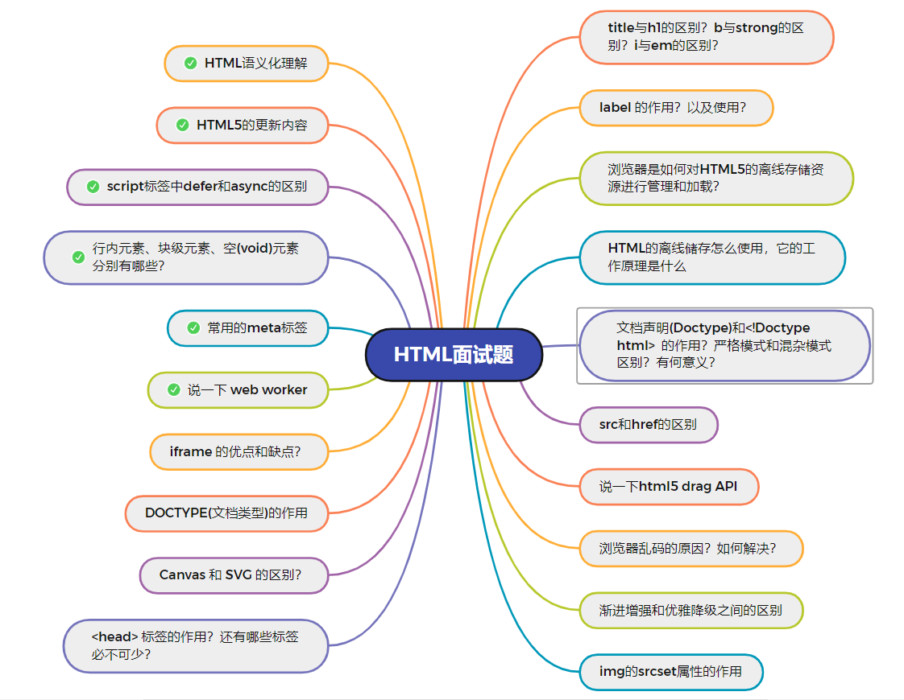

### #说明
> 带 √ 的为常见面试题（可能不准确）


# HTML 面试题整理

## 1.HTML 语义化理解

**语义化是指根据内容的结构化（内容语义化），选择合适的标签（代码语义化）**。通俗来讲就是用正确的标签做正确的事情。

**语义化的优点如下：**

- 对机器友好，带有语义的文字表现力丰富，更适合搜索引擎的爬虫爬取有效信息，**有利于 SEO**。除此之外，语义类还支持读屏软件，根据文章可以自动生成目录；
- 对开发者友好，使用语义类标签**增强了可读性，结构更加清晰**，开发者能清晰的看出网页的结构，便于团队的开发与维护。

**SEO 优化：**

- **语义化元素**
- **title 和 meta 标签描述页面内容**
- **logo 使用 a 标签加背景图**

**常见的语义化标签：**

```html
<header></header> 头部
<nav></nav> 导航栏
<section></section> 区块（有语义化的div）
<main></main> 主要区域
<article></article> 主要内容
<aside></aside> 侧边栏
<footer></footer> 底部
```

## 2.HTML5 的更新内容

### 2.1. 语义化标签

- header：定义文档的页眉（头部）；
- nav：定义导航链接的部分；
- footer：定义文档或节的页脚（底部）；
- article：定义文章内容；
- section：定义文档中的节（section、区段）；
- aside：定义其所处内容之外的内容（侧边）；

### 2.2. 媒体标签

**（1） audio：音频**

```html
<audio src=" " controls autoplay loop=" true "></audio>
```

**属性：**

- controls 控制是否显示面板
- autoplay 自动播放
- loop=‘true’ 循环播放

**（2）video 视频**

```html
<video src=" " poster=" imgs/aa.jpg " controls></video>
```

**属性：**

- poster：指定视频还没有完全下载完毕，或者用户还没有点击播放前显示的封面。默认显示当前视频文件的第一针画面，当然通过 poster 也可以自己指定。
- controls 控制是否显示面板
- width 宽度
- height 高度

**（3）source 标签**

因为浏览器对视频格式支持程度不一样，为了能够兼容不同的浏览器，可以通过 source 来指定视频源。

### 2.3. 表单

**表单类型：**

- email ：能够验证当前输入的邮箱地址是否合法
- url ： 验证 URL
- number ： 只能输入数字，其他输入不了，而且自带上下增大减小箭头，max 属性可以设置为最大值，min 可以设置为最小值，value 为默认值。
- search ： 输入框后面会给提供一个小叉，可以删除输入的内容，更加人性化。
- range ： 可以提供给一个范围，其中可以设置 max 和 min 以及 value，其中 value 属性可以设置为默认值
- color ： 提供了一个颜色拾取器
- time ： 时分秒
- data ： 日期选择年月日
- datatime ： 时间和日期(目前只有 Safari 支持)
- **datetime-local** ：日期时间控件
- week ：周控件
- month：月控件

**表单属性：**

- placeholder ：提示信息
- autofocus ：自动获取焦点
- autocomplete=“on” 或者 autocomplete=“off” 使用这个属性需要有两个前提：
  - 表单必须提交过
  - 必须有 name 属性。
- required：要求输入框不能为空，必须有值才能够提交。
- pattern=" " 里面写入想要的正则模式，例如手机号 patte="^(+86)?\d{10}$"
- multiple：可以选择多个文件或者多个邮箱
- form=" form 表单的 ID"

**表单事件：**

- oninput 每当 input 里的输入框内容发生变化都会触发此事件。
- oninvalid 当验证不通过时触发此事件。

### 2.4. 进度条、度量器

- progress 标签：用来表示任务的进度（IE、Safari 不支持），max 用来表示任务的进度，value 表示已完成多少
- meter 属性：用来显示剩余容量或剩余库存（IE、Safari 不支持）
  - high/low：规定被视作高/低的范围
  - max/min：规定最大/小值
  - value：规定当前度量值

设置规则：min < low < high < max

### 2.5.DOM 查询操作

- `document.querySelector()` 获取元素
- `document.querySelectorAll()` 获取多个元素

它们选择的对象可以是标签，可以是类(需要加点)，可以是 ID(需要加#) `(.div) (#div)`

### 2.6. Web 存储

HTML5 提供了两种在客户端存储数据的新方法：

- localStorage - 没有时间限制的数据存储
- sessionStorage - 针对一个 session 的数据存储

#### 2.7. 其他

- **拖放：** 拖放是一种常见的特性，即抓取对象以后拖到另一个位置。设置元素可拖放：

```html

```

- **画布（canvas ）**： `canvas` 元素使用 JavaScript 在网页上绘制图像。画布是一个矩形区域，可以控制其每一像素。**canvas 拥有多种绘制路径、矩形、圆形、字符以及添加图像的方法**。

```html
<canvas id="myCanvas" width="200" height="100"></canvas>
```

- **SVG**：**SVG 指可伸缩矢量图形，用于定义用于网络的基于矢量的图形**，使用 XML 格式定义图形，图像在放大或改变尺寸的情况下其图形质量不会有损失，它是万维网联盟的标准
- **地理定位**：Geolocation（地理定位）用于定位用户的位置。

**总结：** **（1）新增语义化标签** ：`nav、header、footer、aside、section、article` **（2）音频、视频标签** ：`audio、video` **（3）数据存储** ：`localStorage、sessionStorage` **（4）canvas（画布）、Geolocation（地理定位）、websocket（通信协议）** **（5）input 标签新增属性**：`placeholder、autocomplete、autofocus、required` **（6）history API**：`go、forward、back、pushstate`

**移除的元素有：**

- 纯表现的元素： `basefont，big，center，font, s，strike，tt，u` ;
- 对可用性产生负面影响的元素：`frame，frameset，noframes` ；

## 3.script 标签中 defer 和 async 的区别

- 多个带 defer 的 script 标签里 js 同步执行，async 是异步执行
- defer 等所有元素解析完成之后，DOMContentLoaded 之前执行

## 4.行内元素、块级元素、空(void)元素分别有哪些？

- **行内元素**有：`a b span img input select strong`；
- **块级元素**有：`div ul ol li dl dt dd h1 h2 h3 h4 h5 h6 p`；

**空元素，即没有内容的 HTML 元素。空元素是在开始标签中关闭的，也就是空元素没有闭合标签**：

- 常见的有：`<br>`、`<hr>`、``、`<input>`、`<link>`、`<meta>`；
- 鲜见的有：`<area>`、`<base>`、`<col>`、`<colgroup>`、`<command>`、`<embed>`、`<keygen>`、`<param>`、`<source>`、`<track>`、`<wbr>`。

## 5.常用的 meta 标签？

`meta` 标签由 `name` 和 `content` 属性定义，**用来描述网页文档的属性**，比如网页的作者，网页描述，关键词等，除了 HTTP 标准固定了一些`name`作为大家使用的共识，开发者还可以自定义 name。

常用的 meta 标签： （1）`charset`，**用来描述 HTML 文档的编码类型**：

```html
<meta charset="UTF-8" />
```

（2） `keywords`，**页面关键词**：

```html
<meta name="keywords" content="关键词" />
```

（3）`description`，**页面描述**：

```html
<meta name="description" content="页面描述内容" />
```

（4）`refresh`，**页面重定向和刷新**：

```html
<meta http-equiv="refresh" content=" 0 ; url=" />
```

（5）`viewport`，**适配移动端，可以控制视口的大小和比例**：

```html
<meta
  name="viewport"
  content="width=device-width, initial-scale=1, maximum-scale=1"
/>
```

其中，`content` 参数有以下几种：

- `width viewport` ：宽度(数值/device-width)
- `height viewport` ：高度(数值/device-height)
- `initial-scale` ：初始缩放比例
- `maximum-scale` ：最大缩放比例
- `minimum-scale` ：最小缩放比例
- `user-scalable` ：是否允许用户缩放(yes/no）

**（6）搜索引擎索引方式：**

```html
<meta name="robots" content="index,follow" />
```

其中，`content` 参数有以下几种：

- `all`：文件将被检索，且页面上的链接可以被查询；
- `none`：文件将不被检索，且页面上的链接不可以被查询；
- `index`：文件将被检索；
- `follow`：页面上的链接可以被查询；
- `noindex`：文件将不被检索；
- `nofollow`：页面上的链接不可以被查询。

## 6.说一下 web worker

- Web Worker 的作用，就是为 JavaScript 创造多线程环境，允许主线程创建 Worker 线程，将一些任务分配给后者运行
- Worker 线程一旦新建成功，就会始终运行，不会被主线程上的活动（比如用户点击按钮、提交表单）打断。这样有利于随时响应主线程的通信。但是，这也造成了 Worker 比较耗费资源，不应该过度使用，而且一旦使用完毕，就应该关闭。
- 通过 postMessage 将结果回传到主线程，这样复杂操作的时候，就不会阻塞主进程了
- [阮一峰文章](https://www.ruanyifeng.com/blog/2018/07/web-worker.html)

## 7.iframe 的优点和缺点？

**iframe 元素会创建包含另外一个文档的内联框架（即行内框架）。**

**优点：**

- 用来加载速度较慢的内容（如广告）
- 可以使脚本可以并行下载
- 可以实现跨子域通信

**缺点：**

- iframe 会阻塞主页面的 onload 事件
- 无法被一些搜索引擎索识别
- 会产生很多页面，不容易管理

## 8.DOCTYPE(文档类型)的作用

**DOCTYPE**是 HTML5 中一种标准通用标记语言的**文档类型声明**，它的目的是**告诉浏览器（解析器）应该以什么样（html 或 xhtml）的文档类型定义来解析文档**，不同的渲染模式会影响浏览器对 CSS 代码甚⾄ JavaScript 脚本的解析。**它必须声明在 HTML ⽂档的第⼀⾏**。

浏览器渲染页面的**两种模式**（可通过`document.compatMode`获取，比如，语雀官网的文档类型是**CSS1Compat**）：

- **CSS1Compat：标准模式（Strick mode）**，默认模式，浏览器使用 W3C 的标准解析渲染页面。在标准模式中，浏览器以其支持的最高标准呈现页面。
- **BackCompat：怪异模式(混杂模式)(Quick mode)**，浏览器使用自己的怪异模式解析渲染页面。在怪异模式中，页面以一种比较宽松的向后兼容的方式显示。

## 9.Canvas 和 SVG 的区别？

- **canvas 是画布**，适合图形密集型的游戏，不支持事件处理，
- **svg 是矢量图**，不依赖分辨率，不适合游戏，适合大型渲染区域（地图），支持事件处理

**注意**：矢量图，也称为面向对象的图像或绘图图像，在数学上定义为一系列由线连接的点。矢量文件中的图形元素称为对象。每个对象都是一个自成一体的实体，它具有颜色、形状、轮廓、大小和屏幕位置等属性。

## 10.head 标签的作用？还有哪些标签必不可少？

**标签用于定义文档的头部，它是所有头部元素的容器。** 下面这些标签可用在 head 部分：`<base>, <link>, <meta>, <script>, <style>, <title>`。其中 `<title>` 定义文档的标题，**它是 head 部分中唯一必需的元素**。

## 11.title 与 h1 的区别？b 与 strong 的区别？i 与 em 的区别？

**strong 标签有语义**，是起到**加重语气**的效果，而**b 标签是没有的**，**b 标签只是一个简单加粗标签**。b 标签之间的字符都设为粗体，**strong 标签加强字符的语气都是通过粗体来实现的**，而**搜索引擎更侧重 strong 标签**。

**title 属性**没有明确意义只表示是个**标题**，**H1**则表示**层次明确的标题**，对页面信息的抓取有很大的影响

**i 内容展示为斜体，em 表示强调的文本**

## 12.label 的作用？以及使用？

**label 标签来定义表单控件的关系**：当用户选择 label 标签时，浏览器会**自动将焦点转到和 label 标签**相关的表单控件上。

```html
<label for="mobile">Number:</label>
<input type="text" id="mobile" />

<label>Date:<input type="text" /></label>
```

## 13.浏览器是如何对 HTML5 的离线存储资源进行管理和加载？

**在线的情况下**，浏览器发现 html 头部有 `manifest` 属性，它会请求 `manifest `文件，如果是**第一次访问**页面 ，那么浏览器就会根据 manifest 文件的内容**下载相应的资源并且进行离线存储**。如果**已经访问**过页面并且资源已经进行离线存储了，那么浏览器就**会使用离线的资源加载页面**，然后浏览器会对比新的 manifest 文件与旧的 manifest 文件，如果文件没有发生改变，就不做任何操作，如果文件改变了，就会重新下载文件中的资源并进行离线存储。

**离线的情况下**，浏览器会直接使用离线存储的资源。

## 14.HTML 的离线储存怎么使用，它的工作原理是什么?

- 指的是没有网络连接的时候，可以正常访问应用，与网络连接时更新缓存文件

- 在 `cache.manifest` 文件中编写需要离线存储的资源：

- ```html
  <html lang="en" manifest="index.manifest"></html>
  ```

- 在离线状态时，操作 `window.applicationCache` 进行离线缓存的操作。

- 如何清除缓存：更新 manifest 文件，通过 javascript 操作，清除浏览器缓存

- **原理：** HTML5 的离线存储是基于一个新建的 `.appcache` 文件的缓存机制(不是存储技术)，通过这个文件上的解析清单离线存储资源，这些资源就会像 cookie 一样被存储了下来。之后当网络在处于离线状态下时，浏览器会通过被离线存储的数据进行页面展示

## 15.文档声明(Doctype)和<!Doctype html> 的作用？严格模式和混杂模式区别？有何意义？

- `<!doctype html>` 的作用就是让浏览器进入标准模式，使用最新的 `HTML5` 标准来解析渲染页面；如果不写，则进入混杂模式
- 严格模式（标准模式）：以`w3c`标准解析代码
- 混杂模式（怪异模式）：浏览器用自己的方式解析代码，混杂模式通常模拟老式浏览器的行为，以防止老站点无法工作
- `HTML5` 没有 `DTD` ，因此也就没有严格模式与混杂模式的区别，`HTML5` 有相对宽松的方法，实现时，已经尽可能大的实现了向后兼容(**HTML5 没有严格和混杂之分**)。

## 16.src 和 href 的区别

src 和 href 都是**用来引用外部的资源**，它们的区别如下：

- **src：** **表示对资源的引用，它指向的内容会嵌入到当前标签所在的位置**。**src 会将其指向的资源下载并应⽤到⽂档内**，如请求 js 脚本。当浏览器解析到该元素时，**会暂停其他资源的下载和处理**，直到将该资源加载、编译、执⾏完毕，所以⼀般 js 脚本会放在页面底部。

- **href：** **表示超文本引用，它指向一些网络资源，建立和当前元素或本文档的链接关系**。当浏览器识别到它他指向的⽂件时，就会并⾏下载资源，**不会停⽌对当前⽂档的处理**。 常用在 a、link 等标签上。

## 17.说一下 html5 drag API

- dragstart：事件主体是被拖放元素，在开始拖放被拖放元素时触发。

- darg：事件主体是被拖放元素，在正在拖放被拖放元素时触发。

- dragenter：事件主体是目标元素，在被拖放元素进入某元素时触发。

- dragover：事件主体是目标元素，在被拖放在某元素内移动时触发。

- dragleave：事件主体是目标元素，在被拖放元素移出目标元素是触发。

- drop：事件主体是目标元素，在目标元素完全接受被拖放元素时触发。

- dragend：事件主体是被拖放元素，在整个拖放操作结束时触发。

## 18.浏览器乱码的原因？如何解决？

**产生乱码的原因：**

- 网页源代码是`gbk`的编码，而内容中的中文字是`utf-8`编码的，这样浏览器打开即会出现`html`乱码，反之也会出现乱码；
- `html`网页编码是`gbk`，而程序从数据库中调出呈现是`utf-8`编码的内容也会造成编码乱码；
- 浏览器不能自动检测网页编码，造成网页乱码。

**解决办法：**

- 使用软件编辑 HTML 网页内容；
- 如果网页设置编码是`gbk`，而数据库储存数据编码格式是`UTF-8`，此时需要程序查询数据库数据显示数据前进程序转码；
- 如果浏览器浏览时候出现网页乱码，在浏览器中找到转换编码的菜单进行转换。

## 19.渐进增强和优雅降级之间的区别

- **渐进增强** 是针对低版本浏览器也能保证基础功能，然后对高级浏览器改进追加功能；
- **优雅降级** 是一开始构建完整功能，再对低版本进行兼容

## 20.img 的 srcset 属性的作用

**响应式页面中经常用到根据屏幕密度设置不同的图片**。这时就用到了 img 标签的`srcset`属性。srcset 属性**用于设置不同屏幕密度下，img 会自动加载不同的图片**。用法如下：

```html


```

其中`srcset`指定**图片的地址和对应的图片质量**。`sizes`用来**设置图片的尺寸零界点**。对于 **srcset 中的 w** 单位，可以理解成**图片质量**。如果可视区域小于这个质量的值，就可以使用。浏览器会自动选择一个最小的可用图片。

```html
sizes="[media query] [length], [media query] [length] ... "
```

sizes 就是指默认显示 128px, 如果视区宽度大于 360px, 则显示 340px。
