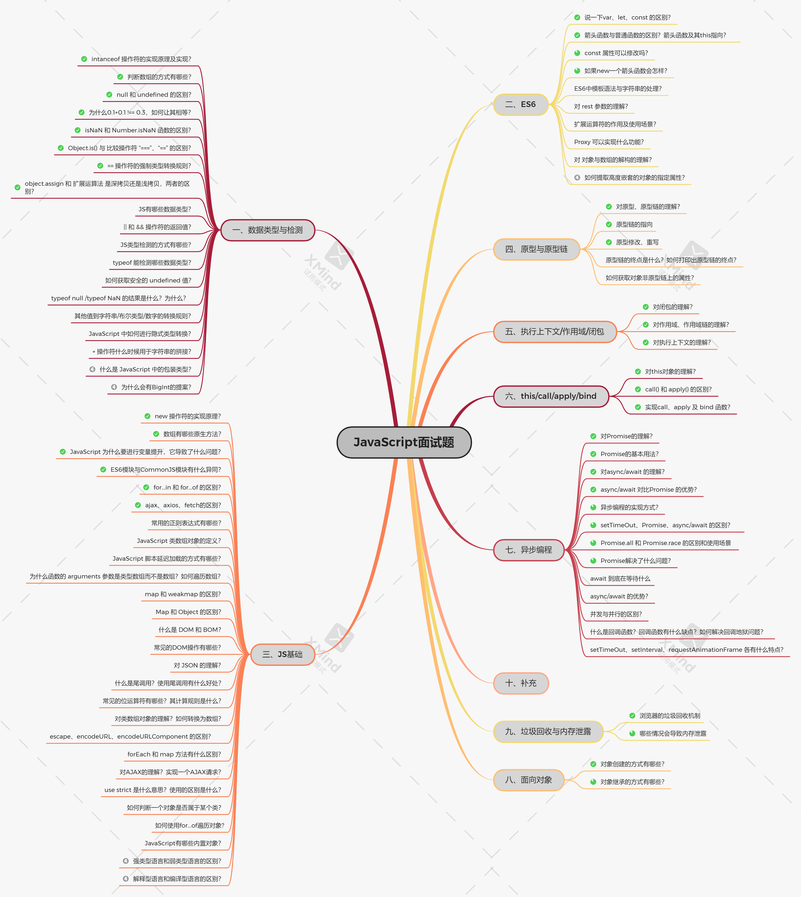
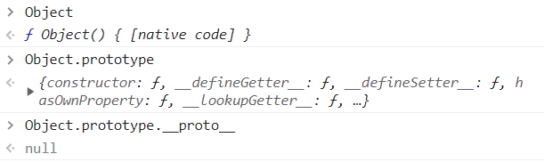

::: tip
包含：四、原型与原型链、五.执行上下文/作用域链/闭包、六.this/call/apply/bind？、七.异步编程、八、面向对象、九.垃圾回收与内存泄漏
:::

<!-- more -->

# #markdown 正文

> 带 ✅ 的为常见面试题（可能不准确）带 ❌ 的表示不常用 📢
>
> [JavaScript 面试题 PDF 文件](https://ychzx.top/studyWeb/interview/JavaScript面试题.pdf)



# JavaScript 面试题

## 四、原型与原型链

### ✅1.对原型、原型链的理解?

在 JavaScript 中是使用构造函数来新建一个对象的，每一个构造函数的内部都有一个 `prototype` 属性，它的属性值是一个对象，这个对象包含了可以由**该构造函数的所有实例共享的属性和方法**。当使用构造函数新**建一个对象**后，在这个对象的内部将包含一个**指针**，这个指针**指向构造函数的 prototype 属性**对应的值，在 **ES5** 中这个指针被称为**对象的原型**。一般来说不应该能够获取到这个值的，但是现在浏览器中都实现了 `proto` 属性来访问这个属性，但是最好不要使用这个属性，因为它**不是规范中规定**的。ES5 中新增了一个 `Object.getPrototypeOf()` 方法，可以通过这个方法来获取对象的原型。

当访问一个对象的属性时，如果这个对象内部不存在这个属性，那么它就会去它的原型对象里找这个属性，这个原型对象又会有自己的原型，于是就这样一直找下去，也就是**原型链的概念**。**原型链的尽头**一般来说都是 `Object.prototype` 所以这就是新建的对象为什么能够使用 toString() 等方法的原因。

**特点：** JavaScript 对象是通过引用来传递的，创建的每个新对象实体中并没有一份属于自己的原型副本。当修改原型时，与之相关的对象也会继承这一改变。

### ✅2.原型链指向?

```js
p.__proto__ // Person.prototype
Person.prototype.__proto__ // Object.prototype
p.__proto__.__proto__ //Object.prototype
p.__proto__.constructor.prototype.__proto__ // Object.prototype
Person.prototype.constructor.prototype.__proto__ // Object.prototype
p1.__proto__.constructor // Person
Person.prototype.constructor // Person
```

### ✅3.原型修改、重写?

```javascript
function Person(name) {
  this.name = name
}
// 修改原型
Person.prototype.getName = function () {}
var p = new Person('hello')
console.log(p.__proto__ === Person.prototype) // true
console.log(p.__proto__ === p.constructor.prototype) // true
// 重写原型
Person.prototype = {
  getName: function () {}
}
var p = new Person('hello')
console.log(p.__proto__ === Person.prototype) // true
console.log(p.__proto__ === p.constructor.prototype) // false
复制代码
```

可以看到修改原型的时候 p 的构造函数不是指向 Person 了，因为直接给 Person 的原型对象直接用对象赋值时，它的构造函数指向的了根构造函数 Object，所以这时候`p.constructor === Object` ，而不是`p.constructor === Person`。要想成立，就要用 constructor 指回来：

```javascript
Person.prototype = {
  getName: function () {}
}
var p = new Person('hello')
p.constructor = Person
console.log(p.__proto__ === Person.prototype) // true
console.log(p.__proto__ === p.constructor.prototype) // true
```

### 4.原型链的终点是什么？如何打印出原型链的终点？

由于`Object`是构造函数，原型链终点是`Object.prototype.__proto__`，而`Object.prototype.__proto__=== null // true`，所以，原型链的终点是`null`。原型链上的所有原型都是对象，所有的对象最终都是由`Object`构造的，而`Object.prototype`的下一级是`Object.prototype.__proto__`。



### 5.如何获得对象非原型链上的属性？

使用后`hasOwnProperty()`方法来判断属性是否属于原型链的属性：

```js
function iterate(obj) {
  var res = []
  for (var key in obj) {
    if (obj.hasOwnProperty(key)) res.push(key + ': ' + obj[key])
  }
  return res
}
```

## 五.执行上下文/作用域链/闭包

### ✅1.对闭包的理解?

**闭包是指有权访问另一个函数作用域中变量的函数**，创建闭包的最常见的方式就是在一个函数内创建另一个函数，创建的函数可以访问到当前函数的局部变量。

闭包有两个常用的**用途**；

- 闭包的第一个用途是使我们在函数外部能够访问到函数内部的变量。通过使用闭包，可以通过在外部调用闭包函数，从而在外部访问到函数内部的变量，可以使用这种方法来创建私有变量。
- 闭包的另一个用途是使已经运行结束的函数上下文中的变量对象继续留在内存中，因为闭包函数保留了这个变量对象的引用，所以这个变量对象不会被回收。

### ✅2.对作用域、作用域链的理解?

**1）全局作用域和函数作用域**

（1）**全局作用域**

- 最外层函数和最外层函数外面定义的变量拥有全局作用域
- 所有未定义直接赋值的变量自动声明为全局作用域
- 所有 window 对象的属性拥有全局作用域
- 全局作用域有很大的弊端，过多的全局作用域变量会污染全局命名空间，容易引起命名冲突。

（2）**函数作用域**

- 函数作用域声明在函数内部的变零，一般只有固定的代码片段可以访问到
- 作用域是分层的，内层作用域可以访问外层作用域，反之不行

**2）块级作用域**

- 使用 ES6 中新增的 let 和 const 指令可以声明块级作用域，块级作用域可以在函数中创建也可以在一个代码块中的创建（由{ }包裹的代码片段）
- let 和 const 声明的变量不会有变量提升，也不可以重复声明
- 在循环中比较适合绑定块级作用域，这样就可以把声明的计数器变量限制在循环内部。 在当前作用域中查找所需变量，但是该作用域没有这个变量，那这个变量就是自由变量。如果在自己作用域找不到该变量就去父级作用域查找，依次向上级作用域查找，直到访问到 window 对象就被终止，这一层层的关系就是作用域链。

**作用域链**的**作用**是**保证对执行环境有权访问的所有变量和函数的有序访问，通过作用域链，可以访问到外层环境的变量和函数**。

**作用域链的本质上是一个指向变量对象的指针列表**。变量对象是一个包含了执行环境中所有变量和函数的对象。作用域链的前端始终都是当前执行上下文的变量对象。全局执行上下文的变量对象（也就是全局对象）始终是作用域链的最后一个对象。

当查找一个变量时，如果当前执行环境中没有找到，可以沿着作用域链向后查找。

### ✅3.对执行上下文的理解?

1. **执行上下文类型**

**（1）全局执行上下文**

任何不在函数内部的都是全局执行上下文，它首先会创建一个全局的 window 对象，并且设置 this 的值等于这个全局对象，一个程序中只有一个全局执行上下文。

**（2）函数执行上下文**

当一个函数被调用时，就会为该函数创建一个新的执行上下文，函数的上下文可以有任意多个。

**（3）**`eval`**函数执行上下文**

执行在 eval 函数中的代码会有属于他自己的执行上下文，不过 eval 函数不常使用，不做介绍。

2. **执行上下文栈**

- JavaScript 引擎使用执行上下文栈来管理执行上下文
- 当 JavaScript 执行代码时，首先遇到全局代码，会创建一个全局执行上下文并且压入执行栈中，每当遇到一个函数调用，就会为该函数创建一个新的执行上下文并压入栈顶，引擎会执行位于执行上下文栈顶的函数，当函数执行完成之后，执行上下文从栈中弹出，继续执行下一个上下文。当所有的代码都执行完毕之后，从栈中弹出全局执行上下文。

```js
let a = 'Hello World!'
function first() {
  console.log('Inside first function')
  second()
  console.log('Again inside first function')
}
function second() {
  console.log('Inside second function')
}
first()
//执行顺序
//先执行second(),在执行first()
```

3. **创建执行上下文**

创建执行上下文有两个阶段：**创建阶段**和**执行阶段**

**1）创建阶段**

（1）this 绑定

- 在全局执行上下文中，this 指向全局对象（window 对象）
- 在函数执行上下文中，this 指向取决于函数如何调用。如果它被一个引用对象调用，那么 this 会被设置成那个对象，否则 this 的值被设置为全局对象或者 undefined

（2）创建词法环境组件

- 词法环境是一种有**标识符——变量映射**的数据结构，标识符是指变量/函数名，变量是对实际对象或原始数据的引用。
- 词法环境的内部有两个组件：**加粗样式**：环境记录器:用来储存变量个函数声明的实际位置**外部环境的引用**：可以访问父级作用域

（3）创建变量环境组件

- 变量环境也是一个词法环境，其环境记录器持有变量声明语句在执行上下文中创建的绑定关系。

**2）执行阶段** 此阶段会完成对变量的分配，最后执行完代码。

**简单来说执行上下文就是指：**

在执行一点 JS 代码之前，需要先解析代码。解析的时候会先创建一个全局执行上下文环境，先把代码中即将执行的变量、函数声明都拿出来，变量先赋值为 undefined，函数先声明好可使用。这一步执行完了，才开始正式的执行程序。

在一个函数执行之前，也会创建一个函数执行上下文环境，跟全局执行上下文类似，不过函数执行上下文会多出 this、arguments 和函数的参数。

- 全局上下文：变量定义，函数声明
- 函数上下文：变量定义，函数声明，`this`，`arguments`

## 六.this/call/apply/bind？

### ✅1.对 this 对象的理解

this 是执行上下文中的一个属性，它指向最后一次调用这个方法的对象。在实际开发中，this 的指向可以通过四种调用模式来判断。

- 第一种是**函数调用模式**，当一个函数不是一个对象的属性时，直接作为函数来调用时，this 指向全局对象。
- 第二种是**方法调用模式**，如果一个函数作为一个对象的方法来调用时，this 指向这个对象。
- 第三种是**构造器调用模式**，如果一个函数用 new 调用时，函数执行前会新创建一个对象，this 指向这个新创建的对象。
- 第四种是 **apply 、 call 和 bind 调用模式**，这三个方法都可以显示的指定调用函数的 this 指向。其中 apply 方法接收两个参数：一个是 this 绑定的对象，一个是参数数组。call 方法接收的参数，第一个是 this 绑定的对象，后面的其余参数是传入函数执行的参数。也就是说，在使用 call() 方法时，传递给函数的参数必须逐个列举出来。bind 方法通过传入一个对象，返回一个 this 绑定了传入对象的新函数。这个函数的 this 指向除了使用 new 时会被改变，其他情况下都不会改变。

这四种方式，**使用构造器调用模式的优先级最高**，然后是 **apply、call 和 bind 调用** 模式，然后是**方法调用**模式，然后是**函数调用**模式。

### ✅2.call() 和 apply() 的区别？

它们的作用一模一样，区别仅在于传入参数的形式的不同。

- apply 接受两个参数，第一个参数指定了函数体内 this 对象的指向，第二个参数为一个带下标的集合，这个集合可以为数组，也可以为类数组，apply 方法把这个集合中的元素作为参数传递给被调用的函数。
- call 传入的参数数量不固定，跟 apply 相同的是，第一个参数也是代表函数体内的 this 指向，从第二个参数开始往后，每个参数被依次传入函数。

### ✅3.实现 call、apply 及 bind 函数？

**（1）call 函数的实现步骤：**

- 判断调用对象是否为函数，即使是定义在函数的原型上的，但是可能出现使用 call 等方式调用的情况。判断传入上下文对象是否存在，如果不存在，则设置为 window 。
- 处理传入的参数，截取第一个参数后的所有参数。将函数作为上下文对象的一个属性。使用上下文对象来调用这个方法，并保存返回结果。删除刚才新增的属性。返回结果。

**（2）apply 函数的实现步骤：**

- 判断调用对象是否为函数，即使是定义在函数的原型上的，但是可能出现使用 call 等方式调用的情况。判断传入上下文对象是否存在，如果不存在，则设置为 window 。
- 将函数作为上下文对象的一个属性。判断参数值是否传入
- 使用上下文对象来调用这个方法，并保存返回结果。删除刚才新增的属性。返回结果

**（3）bind 函数的实现步骤：**

- 判断调用对象是否为函数，即使是定义在函数的原型上的，但是可能出现使用 call 等方式调用的情况。保存当前函数的引用，获取其余传入参数值。
- 创建一个函数返回。函数内部使用 apply 来绑定函数调用，需要判断函数作为构造函数的情况，这个时候需要传入当前函数的 this 给 apply 调用，其余情况都传入指定的上下文对象。

## 七.异步编程

### ✅1.对 Promise 的理解？

**三个状态**：Pending（进行中）Resolved（已完成）Rejected（已拒绝）

**两个过程**：

- pending -> fulfilled : Resolved（已完成）
- pending -> rejected：Rejected（已拒绝）

**总结：** Promise 对象是异步编程的一种解决方案，最早由社区提出。Promise 是一个构造函数，接收一个函数作为参数，返回一个 Promise 实例。一个 Promise 实例有三种状态，分别是 pending、resolved 和 rejected，分别代表了进行中、已成功和已失败。实例的状态只能由 pending 转变 resolved 或者 rejected 状态，并且状态一经改变，就凝固了，无法再被改变了。

状态的改变是通过 resolve() 和 reject() 函数来实现的，可以在异步操作结束后调用这两个函数改变 Promise 实例的状态，它的原型上定义了一个 then 方法，使用这个 then 方法可以为两个状态的改变注册回调函数。这个回调函数属于微任务，会在本轮事件循环的末尾执行。

**注意：** 在构造 `Promise` 的时候，构造函数内部的代码是立即执行的

### ✅2.Promise 的基本用法？

#### （1）创建 Promise 对象

Promise 对象代表一个异步操作，有三种状态：pending（进行中）、fulfilled（已成功）和 rejected（已失败）。

Promise 构造函数接受一个函数作为参数，该函数的两个参数分别是`resolve`和`reject`。

**一般情况下都会使用**`new Promise()`**来创建 promise 对象，但是也可以使用**`promise.resolve`**和**`promise.reject`**这两个方法：**

- **Promise.resolve**

`Promise.resolve(value)`的返回值也是一个 promise 对象，可以对返回值进行.then 调用，代码如下：

```js
Promise.resolve(11).then(function (value) {
  console.log(value) // 打印出11
})
```

`resolve(11)`代码中，会让 promise 对象进入确定(`resolve`状态)，并将参数`11`传递给后面的`then`所指定的`onFulfilled` 函数；

创建 promise 对象可以使用`new Promise`的形式创建对象，也可以使用`Promise.resolve(value)`的形式创建 promise 对象；

- **Promise.reject**

`Promise.reject` 也是`new Promise`的快捷形式，也创建一个 promise 对象。代码如下：

```js
Promise.reject(new Error('我错了，请原谅俺！！'))
```

就是下面的代码 new Promise 的简单形式：

```js
new Promise(function (resolve, reject) {
  reject(new Error('我错了！'))
})
```

下面是使用 resolve 方法和 reject 方法：

```js
function testPromise(ready) {
  return new Promise(function (resolve, reject) {
    if (ready) {
      resolve('hello world')
    } else {
      reject('No thanks')
    }
  })
}
// 方法调用
testPromise(true).then(
  function (msg) {
    console.log(msg)
  },
  function (error) {
    console.log(error)
  }
)
```

上面的代码的含义是给`testPromise`方法传递一个参数，返回一个 promise 对象，如果为`true`的话，那么调用 promise 对象中的`resolve()`方法，并且把其中的参数传递给后面的`then`第一个函数内，因此打印出 “`hello world`”, 如果为`false`的话，会调用 promise 对象中的`reject()`方法，则会进入`then`的第二个函数内，会打印`No thanks`；

#### （2）Promise 方法

Promise 有五个常用的方法：then()、catch()、all()、race()、finally。下面就来看一下这些方法。

**1. then()**

当 Promise 执行的内容符合成功条件时，调用`resolve`函数，失败就调用`reject`函数。Promise 创建完了，那该如何调用呢？

`then`方法可以接受两个回调函数作为参数。第一个回调函数是 Promise 对象的状态变为`resolved`时调用，第二个回调函数是 Promise 对象的状态变为`rejected`时调用。其中第二个参数可以省略。 `then`方法返回的是一个新的 Promise 实例（不是原来那个 Promise 实例）。因此可以采用链式写法，即`then`方法后面再调用另一个 then 方法。

当要写有顺序的异步事件时，需要串行时，可以这样写：

```js
let promise = new Promise((resolve, reject) => {
  ajax('first').success(function (res) {
    resolve(res)
  })
})
promise
  .then((res) => {
    return new Promise((resovle, reject) => {
      ajax('second').success(function (res) {
        resolve(res)
      })
    })
  })
  .then((res) => {
    return new Promise((resovle, reject) => {
      ajax('second').success(function (res) {
        resolve(res)
      })
    })
  })
  .then((res) => {})
```

那当要写的事件没有顺序或者关系时，还如何写呢？可以使用`all` 方法来解决。

**2. catch()**

Promise 对象除了有 then 方法，还有一个 catch 方法，该方法相当于`then`方法的第二个参数，指向`reject`的回调函数。不过`catch`方法还有一个作用，就是在执行`resolve`回调函数时，如果出现错误，抛出异常，不会停止运行，而是进入`catch`方法中。

```js
p.then(
  (data) => {
    console.log('resolved', data)
  },
  (err) => {
    console.log('rejected', err)
  }
)
p.then((data) => {
  console.log('resolved', data)
}).catch((err) => {
  console.log('rejected', err)
})
```

**3. all()**

`all`方法可以完成并行任务， 它接收一个数组，数组的每一项都是一个`promise`对象。当数组中所有的`promise`的状态都达到`resolved`的时候，`all`方法的状态就会变成`resolved`，如果有一个状态变成了`rejected`，那么`all`方法的状态就会变成`rejected`。

```js
let promise1 = new Promise((resolve, reject) => {
  setTimeout(() => {
    resolve(1)
  }, 2000)
})
let promise2 = new Promise((resolve, reject) => {
  setTimeout(() => {
    resolve(2)
  }, 1000)
})
let promise3 = new Promise((resolve, reject) => {
  setTimeout(() => {
    resolve(3)
  }, 3000)
})
Promise.all([promise1, promise2, promise3]).then((res) => {
  console.log(res)
  //结果为：[1,2,3]
})
```

调用`all`方法时的结果成功的时候是回调函数的参数也是一个数组，这个数组按顺序保存着每一个 promise 对象`resolve`执行时的值。

**（4）race()**

`race`方法和`all`一样，接受的参数是一个每项都是`promise`的数组，但是与`all`不同的是，当最先执行完的事件执行完之后，就直接返回该`promise`对象的值。如果第一个`promise`对象状态变成`resolved`，那自身的状态变成了`resolved`；反之第一个`promise`变成`rejected`，那自身状态就会变成`rejected`。

```js
let promise1 = new Promise((resolve,reject)=>{
	setTimeout(()=>{
       reject(1);
	},2000)
});
let promise2 = new Promise((resolve,reject)=>{
	setTimeout(()=>{
       resolve(2);
	},1000)
});
let promise3 = new Promise((resolve,reject)=>{
	setTimeout(()=>{
       resolve(3);
	},3000)
});
Promise.race([promise1,promise2,promise3]).then(res=>{
	console.log(res);
	//结果：2
},rej=>{
    console.log(rej)};
)
```

那么`race`方法有什么实际作用呢？当要做一件事，超过多长时间就不做了，可以用这个方法来解决：

```js
Promise.race([promise1, timeOutPromise(5000)]).then((res) => {})
```

**5. finally()**

`finally`方法用于指定不管 Promise 对象最后状态如何，都会执行的操作。该方法是 ES2018 引入标准的。

```javascript
promise
.then(result => {···})
.catch(error => {···})
.finally(() => {···});
```

上面代码中，不管`promise`最后的状态，在执行完`then`或`catch`指定的回调函数以后，都会执行`finally`方法指定的回调函数。

下面是一个例子，服务器使用 Promise 处理请求，然后使用`finally`方法关掉服务器。

```js
server
  .listen(port)
  .then(function () {
    // ...
  })
  .finally(server.stop)
```

`finally`方法的回调函数不接受任何参数，这意味着没有办法知道，前面的 Promise 状态到底是`fulfilled`还是`rejected`。这表明，`finally`方法里面的操作，应该是与状态无关的，不依赖于 Promise 的执行结果。`finally`本质上是`then`方法的特例：

```js
promise.finally(() => {
  // 语句
})
// 等同于
promise.then(
  (result) => {
    // 语句
    return result
  },
  (error) => {
    // 语句
    throw error
  }
)
```

上面代码中，如果不使用`finally`方法，同样的语句需要为成功和失败两种情况各写一次。有了`finally`方法，则只需要写一次。

### ✅3.对 async/await 的理解？

async/await 其实是`Generator` 的语法糖，它能实现的效果都能用 then 链来实现，它是为**优化 then 链**而开发出来的。从字面上来看，async 是“异步”的简写，await 则为等待，所以很好理解 async 用于申明一个 function 是异步的，而 await 用于等待一个异步方法执行完成。当然语法上强制规定**await 只能出现在 asnyc 函数中**。

**async 函数返回的是一个 Promise 对象**。async 函数（包含函数语句、函数表达式、Lambda 表达式）会返回一个 Promise 对象，如果在函数中 return 一个直接量，async 会把这个直接量通过 Promise.resolve() 封装成 Promise 对象。

async 函数返回的是一个 Promise 对象，所以在最外层不能用 await 获取其返回值的情况下，当然应该用原来的方式：then() 链来处理这个 Promise 对象，就像这样：

```js
async function testFn() {
  return 'hello world'
}
let result = testFn()
console.log(result)
result.then((v) => {
  console.log(v) // hello world
})
```

那如果 async 函数没有返回值，又该如何？很容易想到，它会返回 `Promise.resolve(undefined)`。

联想一下 Promise 的特点——无等待，所以在没有 `await` 的情况下执行 async 函数，它会立即执行，返回一个 Promise 对象，并且，绝不会阻塞后面的语句。这和普通返回 Promise 对象的函数并无二致。

注意：`Promise.resolve(x)` 可以看作是 `new Promise(resolve => resolve(x))` 的简写，可以用于快速封装字面量对象或其他对象，将其封装成 Promise 实例。

### ✅4.async/await 对比 Promise 的优势？

- 代码读起来**更加同步**，Promise 虽然摆脱了回调地狱，但是**then 的链式调⽤**也会带来额外的**阅读负担**
- **Promise 传递中间值⾮常麻烦**，⽽ async/await ⼏乎是同步的写法，⾮常优雅
- **错误处理友好**，async/await 可以⽤成熟的`try/catch`，Promise 的错误捕获⾮常冗余
- **调试友好**，Promise 的调试很差，由于没有代码块，你不能在⼀个返回表达式的箭头函数中设置断点，如果你在⼀个.then 代码块中使⽤调试器的步进(step-over)功能，调试器并不会进⼊后续的.then 代码块，因为调试器只能跟踪同步代码的每⼀步。

### 5.异步编程的实现方式？

- **回调函数** 的方式，使用回调函数的方式有一个缺点是，多个回调函数嵌套的时候会造成回调函数地狱，上下两层的回调函数间的代码耦合度太高，不利于代码的可维护。
- **Promise** 的方式，使用 Promise 的方式可以将嵌套的回调函数作为链式调用。但是使用这种方法，有时会造成多个 then 的链式调用，可能会造成代码的语义不够明确。
- **generator** 的方式，它可以在函数的执行过程中，将函数的执行权转移出去，在函数外部还可以将执行权转移回来。当遇到异步函数执行的时候，将函数执行权转移出去，当异步函数执行完毕时再将执行权给转移回来。因此在 generator 内部对于异步操作的方式，可以以同步的顺序来书写。使用这种方式需要考虑的问题是何时将函数的控制权转移回来，因此需要有一个自动执行 generator 的机制，比如说 co 模块等方式来实现 generator 的自动执行。
- **async 函数** 的方式，async 函数是 generator 和 promise 实现的一个自动执行的语法糖，它内部自带执行器，当函数内部执行到一个 await 语句的时候，如果语句返回一个 promise 对象，那么函数将会等待 promise 对象的状态变为 resolve 后再继续向下执行。因此可以将异步逻辑，转化为同步的顺序来书写，并且这个函数可以自动执行。

### 6.setTimeout、Promise、Async/Await 的区别？

#### （1）setTimeout

[window.setTimeout - Web API 接口参考 | MDN (mozilla.org)](https://developer.mozilla.org/zh-CN/docs/Web/API/setTimeout) [`WindowOrWorkerGlobalScope`](https://developer.mozilla.org/zh-CN/docs/Web/API/WindowOrWorkerGlobalScope) 混合的 **`setTimeout()`**方法设置一个定时器，该定时器在定时器到期后执行一个函数或指定的一段代码。

```js
console.log('start') //1. 打印 start
setTimeout(function () {
  console.log('settimeout') // 4. 打印 settimeout
}) // 2. 调用 setTimeout 函数，并定义其完成后执行的回调函数
console.log('end') //3. 打印 start
// 输出顺序：start -> end -> settimeout
```

#### （2）Promise

Promise 本身是**同步的立即执行函数**， 当在 executor 中执行 resolve 或者 reject 的时候, 此时是异步操作， 会先执行 then/catch 等，当主栈完成后，才会去调用 resolve/reject 中存放的方法执行，打印 p 的时候，是打印的返回结果，一个 Promise 实例。

```js
console.log('start')
let promise1 = new Promise(function (resolve) {
  console.log('promise1')
  resolve()
  console.log('promise1 end')
}).then(function () {
  console.log('promise2')
})
setTimeout(function () {
  console.log('settimeout')
})
console.log('end')
// 输出顺序: start -> promise1 -> promise1 end -> end -> promise2 -> settimeout
```

当 JS 主线程执行到 Promise 对象时：

- promise1.then() 的回调就是一个 task
- promise1 是 resolved 或 rejected: 那这个 task 就会放入当前事件循环回合的 microtask queue
- promise1 是 pending: 这个 task 就会放入 事件循环的未来的某个(可能下一个)回合的 microtask queue 中
- setTimeout 的回调也是个 task ，它会被放入 macrotask queue 即使是 0ms 的情况

#### （3）async/await

```js
async function async1() {
  console.log('async1 start')
  await async2()
  console.log('async1 end')
}
async function async2() {
  console.log('async2')
}
console.log('script start')
async1()
console.log('script end')
// 输出顺序：script start->async1 start->async2->script end->async1 end
```

async 函数返回一个 Promise 对象，当函数执行的时候，一旦遇到 await 就会先返回，等到触发的异步操作完成，再执行函数体内后面的语句。可以理解为，是让出了线程，跳出了 async 函数体。

### 7.Promise.all 和 Promise.race 的区别的使用场景？

**（1）Promise.all** `Promise.all`可以将多个`Promise`实例包装成一个新的 Promise 实例。同时，成功和失败的返回值是不同的，成功的时候返回的是**一个结果数组**，而失败的时候则返回**最先被 reject 失败状态的值**。

Promise.all 中传入的是数组，返回的也是是数组，并且会将进行映射，传入的 promise 对象返回的值是按照顺序在数组中排列的，但是注意的是他们执行的顺序并不是按照顺序的，除非可迭代对象为空。

需要注意，Promise.all 获得的成功结果的数组里面的数据顺序和 Promise.all 接收到的数组顺序是一致的，这样当遇到发送多个请求并根据请求顺序获取和使用数据的场景，就可以使用 Promise.all 来解决。

**（2）Promise.race**

**`Promise.race(iterable)`** 方法返回一个 promise，一旦迭代器中的某个 promise 解决或拒绝，返回的 promise 就会解决或拒绝。[Promise.race() - JavaScript | MDN (mozilla.org)](https://developer.mozilla.org/zh-CN/docs/Web/JavaScript/Reference/Global_Objects/Promise/race)

```js
Promise.race([promise1, timeOutPromise(5000)]).then((res) => {})
```

### 8.Promise 解决了什么问题？

- 回调地狱，异步编程

### 9.await 到底在等啥？

**await 在等待什么呢？**一般来说，都认为 **await 是在等待一个 async 函数完成**。不过按语法说明，**await 等待的是一个表达式**，这个表达式的计算结果是 Promise 对象或者其它值（换句话说，就是没有特殊限定）。

因为 async 函数返回一个 Promise 对象，所以 await 可以用于等待一个 **async 函数的返回值**——这也可以说是 **await 在等 async 函数**，但要清楚，它等的实际是**一个返回值**。注意到 await 不仅仅用于等 Promise 对象，它可以等任意表达式的结果，所以，await 后面实际是可以接普通函数调用或者直接量的。

await 表达式的运算结果取决于它等的是什么。

如果它等到的不是一个 Promise 对象，那 await 表达式的运算结果就是它等到的东西。 如果它等到的是一个 Promise 对象，await 就忙起来了，它会阻塞后面的代码，等着 Promise 对象 resolve，然后得到 resolve 的值，作为 await 表达式的运算结果。

### 10.async/await 的优势？

Promise 通过 then 链来解决多层回调的问题，现在又用 async/await 来进一步优化它

### 11.async/await 如何捕获异常？

try catch

```js
async function fn() {
  try {
    let a = await Promise.reject('error')
  } catch (error) {
    console.log(error)
  }
}
```

### 12.什么是回调函数？回调函数有什么缺点？如何解决回调地狱问题？

```js
ajax(url, () => {
  // 处理逻辑
})

// 回调地狱
ajax(url, () => {
  // 处理逻辑
  ajax(url1, () => {
    // 处理逻辑
    ajax(url2, () => {
      // 处理逻辑
    })
  })
})
```

回调地狱的根本问题就是：

1. 嵌套函数存在耦合性，一旦有所改动，就会牵一发而动全身
2. 嵌套函数一多，就很难处理错误

当然，回调函数还存在着别的几个缺点，比如不能使用 `try catch` 捕获错误，不能直接 `return`。

### 13.setTimeout、setInterval、requestAnimationFrame 各有什么特点？

常见的定时器函数有 `setTimeout`、`setInterval`、`requestAnimationFrame`。最常用的是`setTimeout`。

`requestAnimationFrame` 自带函数节流功能，基本可以保证在 16.6 毫秒内只执行一次（不掉帧的情况下），并且该函数的延时效果是精确的，没有其他定时器时间不准的问题，当然你也可以通过该函数来实现 setTimeout。

### 14.并发与并行的区别？

- 并发是宏观概念，我分别有任务 A 和任务 B，在一段时间内通过任务间的切换完成了这两个任务，这种情况就可以称之为并发。
- 并行是微观概念，假设 CPU 中存在两个核心，那么我就可以同时完成任务 A、B。同时完成多个任务的情况就可以称之为并行。

## 八、面向对象

### ✅1.对象创建的方式有哪些？

一般使用字面量的形式直接创建对象，但是这种创建方式对于创建大量相似对象的时候，会产生大量的重复代码。但 js 和一般的面向对象的语言不同，在 ES6 之前它没有类的概念。但是可以使用函数来进行模拟，从而产生出可复用的对象创建方式，常见的有以下几种：

**（1）第一种是工厂模式**，工厂模式的主要工作原理是用函数来封装创建对象的细节，从而通过调用函数来达到复用的目的。但是它有一个很大的问题就是创建出来的对象无法和某个类型联系起来，它只是简单的封装了复用代码，而没有建立起对象和类型间的关系。

**（2）第二种是构造函数模式。**js 中每一个函数都可以作为构造函数，只要一个函数是通过 new 来调用的，那么就可以把它称为构造函数。执行构造函数首先会创建一个对象，然后将对象的原型指向构造函数的 prototype 属性，然后将执行上下文中的 this 指向这个对象，最后再执行整个函数，如果返回值不是对象，则返回新建的对象。因为 this 的值指向了新建的对象，因此可以使用 this 给对象赋值。构造函数模式相对于工厂模式的优点是，所创建的对象和构造函数建立起了联系，因此可以通过原型来识别对象的类型。但是构造函数存在一个缺点就是，造成了不必要的函数对象的创建，因为在 js 中函数也是一个对象，因此如果对象属性中如果包含函数的话，那么每次都会新建一个函数对象，浪费了不必要的内存空间，因为函数是所有的实例都可以通用的。

**（3）第三种模式是原型模式**，因为每一个函数都有一个 prototype 属性，这个属性是一个对象，它包含了通过构造函数创建的所有实例都能共享的属性和方法。因此可以使用原型对象来添加公用属性和方法，从而实现代码的复用。这种方式相对于构造函数模式来说，解决了函数对象的复用问题。但是这种模式也存在一些问题，一个是没有办法通过传入参数来初始化值，另一个是如果存在一个引用类型如 Array 这样的值，那么所有的实例将共享一个对象，一个实例对引用类型值的改变会影响所有的实例。

**（4）第四种模式是组合使用构造函数模式和原型模式**，这是创建自定义类型的最常见方式。因为构造函数模式和原型模式分开使用都存在一些问题，因此可以组合使用这两种模式，通过构造函数来初始化对象的属性，通过原型对象来实现函数方法的复用。这种方法很好的解决了两种模式单独使用时的缺点，但是有一点不足的就是，因为使用了两种不同的模式，所以对于代码的封装性不够好。

**（5）第五种模式是动态原型模式**，这一种模式将原型方法赋值的创建过程移动到了构造函数的内部，通过对属性是否存在的判断，可以实现仅在第一次调用函数时对原型对象赋值一次的效果。这一种方式很好地对上面的混合模式进行了封装。

**（6）第六种模式是寄生构造函数模式**，这一种模式和工厂模式的实现基本相同，我对这个模式的理解是，它主要是基于一个已有的类型，在实例化时对实例化的对象进行扩展。这样既不用修改原来的构造函数，也达到了扩展对象的目的。它的一个缺点和工厂模式一样，无法实现对象的识别。

### ✅2.对象继承的方式有哪些？

**（1）第一种是以原型链的方式来实现继承**，但是这种实现方式存在的缺点是，在包含有引用类型的数据时，会被所有的实例对象所共享，容易造成修改的混乱。还有就是在创建子类型的时候不能向超类型传递参数。

**（2）第二种方式是使用借用构造函数的方式**，这种方式是通过在子类型的函数中调用超类型的构造函数来实现的，这一种方法解决了不能向超类型传递参数的缺点，但是它存在的一个问题就是无法实现函数方法的复用，并且超类型原型定义的方法子类型也没有办法访问到。

**（3）第三种方式是组合继承**，组合继承是将原型链和借用构造函数组合起来使用的一种方式。通过借用构造函数的方式来实现类型的属性的继承，通过将子类型的原型设置为超类型的实例来实现方法的继承。这种方式解决了上面的两种模式单独使用时的问题，但是由于我们是以超类型的实例来作为子类型的原型，所以调用了两次超类的构造函数，造成了子类型的原型中多了很多不必要的属性。

**（4）第四种方式是原型式继承**，原型式继承的主要思路就是基于已有的对象来创建新的对象，实现的原理是，向函数中传入一个对象，然后返回一个以这个对象为原型的对象。这种继承的思路主要不是为了实现创造一种新的类型，只是对某个对象实现一种简单继承，ES5 中定义的 Object.create() 方法就是原型式继承的实现。缺点与原型链方式相同。

**（5）第五种方式是寄生式继承**，寄生式继承的思路是创建一个用于封装继承过程的函数，通过传入一个对象，然后复制一个对象的副本，然后对象进行扩展，最后返回这个对象。这个扩展的过程就可以理解是一种继承。这种继承的优点就是对一个简单对象实现继承，如果这个对象不是自定义类型时。缺点是没有办法实现函数的复用。

**（6）第六种方式是寄生式组合继承**，组合继承的缺点就是使用超类型的实例做为子类型的原型，导致添加了不必要的原型属性。寄生式组合继承的方式是使用超类型的原型的副本来作为子类型的原型，这样就避免了创建不必要的属性。

## 九.垃圾回收与内存泄漏

### ✅1.浏览器的垃圾回收机制

#### （1）垃圾回收的概念

**垃圾回收**：JavaScript 代码运行时，需要分配内存空间来储存变量和值。当变量不在参与运行时，就需要系统收回被占用的内存空间，这就是垃圾回收。

**回收机制**：

- Javascript 具有自动垃圾回收机制，会定期对那些不再使用的变量、对象所占用的内存进行释放，原理就是找到不再使用的变量，然后释放掉其占用的内存。
- JavaScript 中存在两种变量：局部变量和全局变量。全局变量的生命周期会持续要页面卸载；而局部变量声明在函数中，它的生命周期从函数执行开始，直到函数执行结束，在这个过程中，局部变量会在堆或栈中存储它们的值，当函数执行结束后，这些局部变量不再被使用，它们所占有的空间就会被释放。
- 不过，当局部变量被外部函数使用时，其中一种情况就是闭包，在函数执行结束后，函数外部的变量依然指向函数内部的局部变量，此时局部变量依然在被使用，所以不会回收。

#### （2）垃圾回收的方式

浏览器通常使用的垃圾回收方法有两种：标记清除，引用计数。

**1）标记清除**

- 标记清除是浏览器常见的垃圾回收方式，当变量进入执行环境时，就标记这个变量“进入环境”，被标记为“进入环境”的变量是不能被回收的，因为他们正在被使用。当变量离开环境时，就会被标记为“离开环境”，被标记为“离开环境”的变量会被内存释放。
- 垃圾收集器在运行的时候会给存储在内存中的所有变量都加上标记。然后，它会去掉环境中的变量以及被环境中的变量引用的标记。而在此之后再被加上标记的变量将被视为准备删除的变量，原因是环境中的变量已经无法访问到这些变量了。最后。垃圾收集器完成内存清除工作，销毁那些带标记的值，并回收他们所占用的内存空间。

**2）引用计数**

- 另外一种垃圾回收机制就是引用计数，这个用的相对较少。引用计数就是跟踪记录每个值被引用的次数。当声明了一个变量并将一个引用类型赋值给该变量时，则这个值的引用次数就是 1。相反，如果包含对这个值引用的变量又取得了另外一个值，则这个值的引用次数就减 1。当这个引用次数变为 0 时，说明这个变量已经没有价值，因此，在在机回收期下次再运行时，这个变量所占有的内存空间就会被释放出来。
- 这种方法会引起**循环引用**的问题：例如：` obj1`和`obj2`通过属性进行相互引用，两个对象的引用次数都是 2。当使用循环计数时，由于函数执行完后，两个对象都离开作用域，函数执行结束，`obj1`和`obj2`还将会继续存在，因此它们的引用次数永远不会是 0，就会引起循环引用。

```js
function fun() {
  let obj1 = {}
  let obj2 = {}
  obj1.a = obj2 // obj1 引用 obj2
  obj2.a = obj1 // obj2 引用 obj1
}
```

这种情况下，就要手动释放变量占用的内存：

```js
obj1.a = null
obj2.a = null
```

#### （3）减少垃圾回收

虽然浏览器可以进行垃圾自动回收，但是当代码比较复杂时，垃圾回收所带来的代价比较大，所以应该尽量减少垃圾回收。

- **对数组进行优化：** 在清空一个数组时，最简单的方法就是给其赋值为[ ]，但是与此同时会创建一个新的空对象，可以将数组的长度设置为 0，以此来达到清空数组的目的。
- **对**`object`**进行优化：** 对象尽量复用，对于不再使用的对象，就将其设置为 null，尽快被回收。
- **对函数进行优化：** 在循环中的函数表达式，如果可以复用，尽量放在函数的外面。

### 2. 哪些情况会导致内存泄漏

以下四种情况会造成内存的泄漏：

- **意外的全局变量：** 由于使用未声明的变量，而意外的创建了一个全局变量，而使这个变量一直留在内存中无法被回收。
- **被遗忘的计时器或回调函数：** 设置了 setInterval 定时器，而忘记取消它，如果循环函数有对外部变量的引用的话，那么这个变量会被一直留在内存中，而无法被回收。
- **脱离 DOM 的引用：** 获取一个 DOM 元素的引用，而后面这个元素被删除，由于一直保留了对这个元素的引用，所以它也无法被回收。
- **闭包：** 不合理的使用闭包，从而导致某些变量一直被留在内存当中。

## 十.补充
